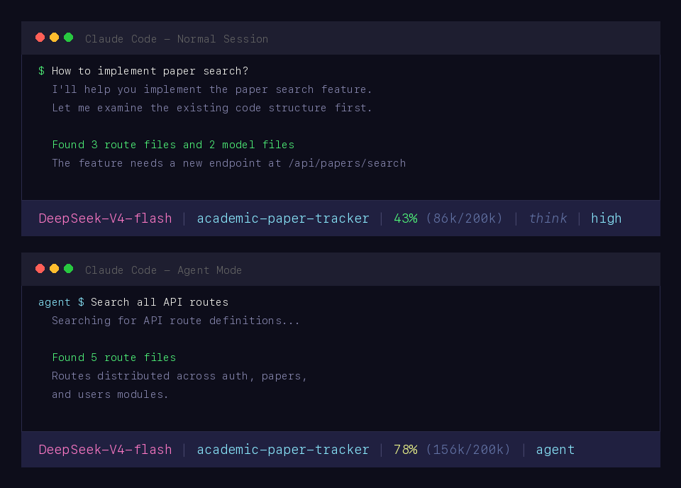

<h1 align="center">
  Claude Code 状态栏
</h1>

<p align="center">
  <em>为 Claude Code 打造的情境感知状态栏——模型、目录、上下文、推理模式，一眼尽览。</em>
</p>

<p align="center">
  <a href="#-功能特性">功能特性</a> •
  <a href="#-效果预览">效果预览</a> •
  <a href="#-快速安装">快速安装</a> •
  <a href="#-自定义">自定义</a> •
  <a href="#-项目结构">项目结构</a> •
  <a href="README.md">English</a>
</p>

<br>

## 📸 效果预览

| 正常模式 | 上下文偏高 | 上下文预警 |
|:---:|:---:|:---:|
|  |  |  |
| 上下文健康 (< 50%) | 较高占用 (50-80%) | 危险占用 (> 80%) |



---

## ✨ 功能特性

- **实时更新** — 每次 AI 回复后自动刷新，无需手动触发
- **单行显示** — 紧凑设计，不干扰主工作区
- **模型显示** — 实时标识当前 AI 模型（如 `DeepSeek-V4-flash`）
- **工作目录** — 路径智能缩短（保留最后 2 级，`~` 代替 Home）
- **上下文监控** — 占用百分比 + 精确 token 用量
- **颜色预警** — 自动变色：绿色（健康）→ 黄色（注意）→ 红色（危险）
- **推理指示** — thinking 深度思考模式提示
- **专注模式** — 显示当前 effort 级别（`high`、`agent`）
- **Agent 标识** — 黄色显示 Agent 子进程名称

## 📊 字段说明

| 字段 | 含义 | 颜色 | 示例 |
|------|------|------|------|
| 模型 | 当前 AI 模型 | **品红色**加粗 | `DeepSeek-V4-flash` |
| 目录 | 当前工作目录 | **蓝色** | `web test/project` |
| 上下文 | 占用百分比 + token | **绿** / **黄** / **红** | `43% (86k/200k)` |
| think | 深度思考模式 | *灰色斜体* | `think` |
| Agent | Agent 子进程名称 | **黄色** | `explore` |
| 专注模式 | 当前 focus 级别 | **青色** | `high` |

### 上下文颜色阈值

| 占用率 | 颜色 | 含义 | 建议 |
|--------|------|------|------|
| < 50% | 🟢 绿色 | 健康 | 继续工作 |
| 50-80% | 🟡 黄色 | 注意 | 考虑精简上下文 |
| > 80% | 🔴 红色 | 危险 | 建议开启新会话 |

---

## 🚀 快速安装

### 前置依赖

- [Claude Code](https://claude.ai/code) 已安装
- [jq](https://jqlang.github.io/jq/) 用于 JSON 解析

```bash
brew install jq
```

### 方式一：一键安装（推荐）

```bash
bash -c "$(curl -fsSL https://raw.githubusercontent.com/tsingke/claude-code-statusline/main/scripts/install.sh)"
```

### 方式二：手动安装

```bash
# 克隆仓库
git clone https://github.com/tsingke/claude-code-statusline.git
cd claude-code-statusline

# 运行安装脚本
chmod +x scripts/install.sh
./scripts/install.sh
```

### 方式三：作为 Claude Code Skill 安装

在 Claude Code 中说：`安装状态栏`

### 安装脚本自动完成：

1. 复制 `scripts/statusline.sh` → `~/.claude/statusline.sh`
2. 在 `~/.claude/settings.json` 中添加 `statusLine` 配置
3. 赋予脚本执行权限

> **重启 Claude Code** 后状态栏即可生效。

---

## 🔧 实现原理

Claude Code 内置的 `statusLine` 配置项允许指定一个 shell 脚本，该脚本在每次 AI 回复后自动执行，并通过 **stdin** 接收完整的会话状态 JSON。脚本输出到 **stdout** 的内容将显示在终端底部。

```
Claude Code 完成响应
         │
         ▼
构建会话状态 JSON（模型、目录、上下文、耗时等）
         │
  stdin  ▼
┌──────────────────┐
│  statusline.sh   │  ← jq 解析 JSON，脚本格式化 + 着色
└──────────────────┘
         │
  stdout ▼
终端底部状态栏
```

---

## 🎨 自定义

Claude Code 发送的 JSON 包含丰富的会话状态字段，你可以自由扩展脚本，添加更多信息：

```bash
# 可添加的字段示例
cost=$(echo "$input" | jq -r '.cost.total_cost_usd // ""')         # 累计费用（USD）
duration=$(echo "$input" | jq -r '.cost.total_duration_ms // ""')  # 会话时长（毫秒）
lines=$(echo "$input" | jq -r '.cost.total_lines_added // ""')     # 新增代码行数
fast=$(echo "$input" | jq -r '.fast_mode // false')                # 是否快速模式
session=$(echo "$input" | jq -r '.session_name // ""')             # 会话名称
```

**调试技巧**：在 `read -r input` 后添加一行，可将完整 JSON 保存到文件：

```bash
echo "$input" > /tmp/claude_statusline_debug.json
```

然后触发一次 Claude Code 回复，检查该文件即可看到所有可用字段。

---

## 📦 项目结构

```
claude-code-statusline/
├── README.md                    # 英文文档
├── README.zh-CN.md              # 中文文档
├── LICENSE                      # MIT 许可证
├── SKILL.md                     # Claude Code 技能注册
├── scripts/
│   ├── statusline.sh            # 状态栏核心脚本
│   ├── install.sh               # 自动安装脚本
│   └── uninstall.sh             # 自动卸载脚本
└── screenshots/
    ├── statusbar-simulator.png  # 完整界面截图
    └── statusbar-closeup.png    # 状态栏特写
```

---

## 🗑️ 卸载

```bash
# 克隆（如果尚未克隆）
git clone https://github.com/tsingke/claude-code-statusline.git
cd claude-code-statusline
./scripts/uninstall.sh

# 或手动清理：
rm -f ~/.claude/statusline.sh
# 并从 ~/.claude/settings.json 中删除 "statusLine" 配置项
```

---

## 📄 许可证

本项目基于 MIT 许可证开源，详情见 [LICENSE](LICENSE) 文件。

---

<p align="center">
  为 Claude Code 社区打造
</p>
